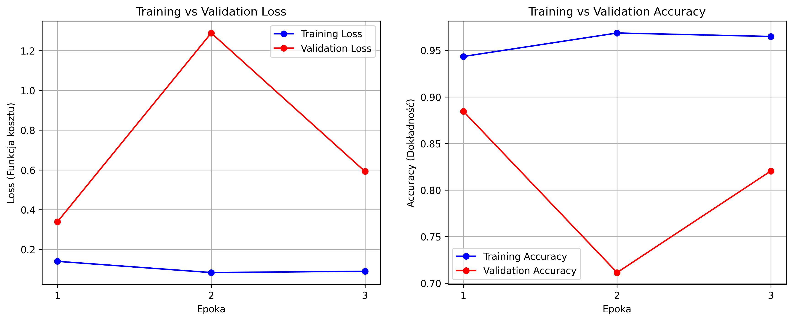
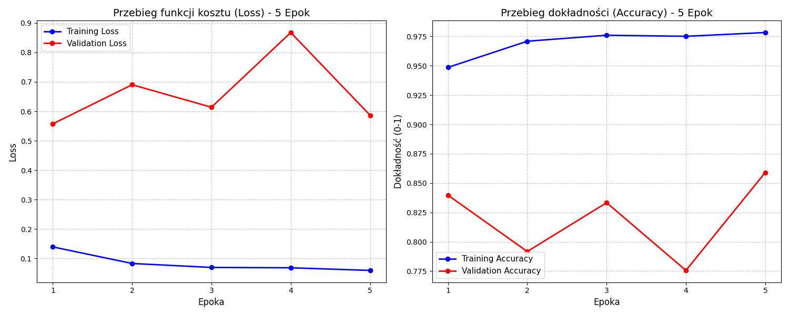

# Project: Chest X-ray Classification (Pneumonia vs Normal)

**Author:** Jan Nowojski

---

## 1. Project Description
The goal of the project is to create and train a machine learning model capable of automatic classification of chest X-ray images into two diagnostic classes:
* **NORMAL:** Healthy patient
* **PNEUMONIA:** Patient with pneumonia

This tool is designed to assist medical professionals in the rapid filtering and prioritization of X-ray scans.

## 2. Mathematical Problem Formulation
The problem is defined as a binary classification task in supervised learning.

Let $\mathcal{X}$ be the space of input images (represented as tensors with dimensions $C \times H \times W$), and $\mathcal{Y} = \{0, 1\}$ be the set of labels, where:
* $y=0$ denotes the *NORMAL* class,
* $y=1$ denotes the *PNEUMONIA* class.

The goal is to find a parametric function $f_\theta: \mathcal{X} \to [0, 1]$, represented by a neural network with weights $\theta$, which approximates the conditional probability of disease occurrence for a given image $x$:

$$P(Y=1 | X=x) \approx f_\theta(x)$$

The classification decision $y$ is made based on the decision threshold ($0.5$):

$$
y = \begin{cases} 
1 & \text{if } f_\theta(x) > 0.5 \\
0 & \text{otherwise}
\end{cases}
$$

---

## 3. Data Preprocessing & Architecture

### Preprocessing
Each input image $x$ undergoes a transformation $T(x)$ to fit the network requirements:
* **Resize:** Scaling to $224 \times 224$ pixels.
* **Augmentation:** Random horizontal flips and rotations to prevent overfitting.
* **Normalization:** Pixel values standardized using ImageNet mean $[0.485, 0.456, 0.406]$ and std $[0.229, 0.224, 0.225]$.

### Architecture: ResNet18
The project uses **Transfer Learning** with the **ResNet18** architecture. It utilizes residual connections to solve the vanishing gradient problem:
$$y = \sigma(\mathcal{F}(x, \{W_i\}) + x)$$

---

## 4. Training Results

Below are the visualizations of the training process, including Loss and Accuracy metrics for both training and validation sets.

### Experiment A: 3 Epochs
In the first experiment, the model reached its peak validation accuracy (~88%) very early. However, signs of overfitting were observed in the second epoch.



### Experiment B: 5 Epochs
Extending the training to 5 epochs showed some instability in the middle (4th epoch drop), but the model eventually recovered to a high validation accuracy of **85.9%**.



---

## 5. How to Run

1. **Install dependencies:**
   ```bash
   pip install -r requirements.txt